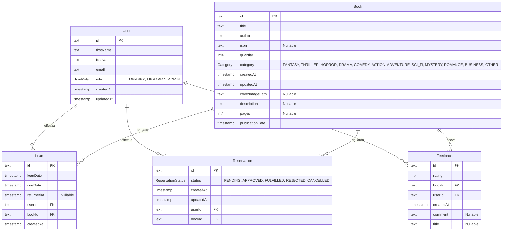

## Database

Questo diagramma mostra il modello dati della webapp e mostra le principali entità del sistema e le relazioni che le collegano.

```mermaid
erDiagram
	direction TB
	User {
		text id PK ""  
		text firstName  ""  
		text lastName  ""  
		text email  ""  
		UserRole role  "MEMBER, LIBRARIAN, ADMIN"  
		timestamp createdAt  ""  
		timestamp updatedAt  ""  
	}

	Loan {
		text id PK ""  
		timestamp loanDate  ""  
		timestamp dueDate  ""  
		timestamp returnedAt  "Nullable"  
		text userId FK ""  
		text bookId FK ""  
		timestamp createdAt  ""  
	}

	Book {
		text id PK ""  
		text title  ""  
		text author  ""  
		text isbn  "Nullable"  
		int4 quantity  ""  
		Category category  "FANTASY, THRILLER, HORROR, DRAMA, COMEDY, ACTION, ADVENTURE, SCI_FI, MYSTERY, ROMANCE, BUSINESS, OTHER"  
		timestamp createdAt  ""  
		timestamp updatedAt  ""  
		text coverImagePath  "Nullable"  
		text description  "Nullable"  
		int4 pages  "Nullable"  
		timestamp publicationDate  ""  
	}

	Reservation {
		text id PK ""  
		ReservationStatus status  "PENDING, APPROVED, FULFILLED, REJECTED, CANCELLED"  
		timestamp createdAt  ""  
		timestamp updatedAt  ""  
		text userId FK ""  
		text bookId FK ""  
	}

	Feedback {
		text id PK ""  
		int4 rating  ""  
		text bookId FK ""  
		text userId FK ""  
		timestamp createdAt  ""  
		text comment  "Nullable"  
		text title  "Nullable"  
	}

	User||--o{Loan:"effettua"
	Book||--o{Loan:"riguarda"
	User||--o{Reservation:"effettua"
	Book||--o{Reservation:"riguarda"
	User||--o{Feedback:"scrive"
	Book||--o{Feedback:"riceve"
```