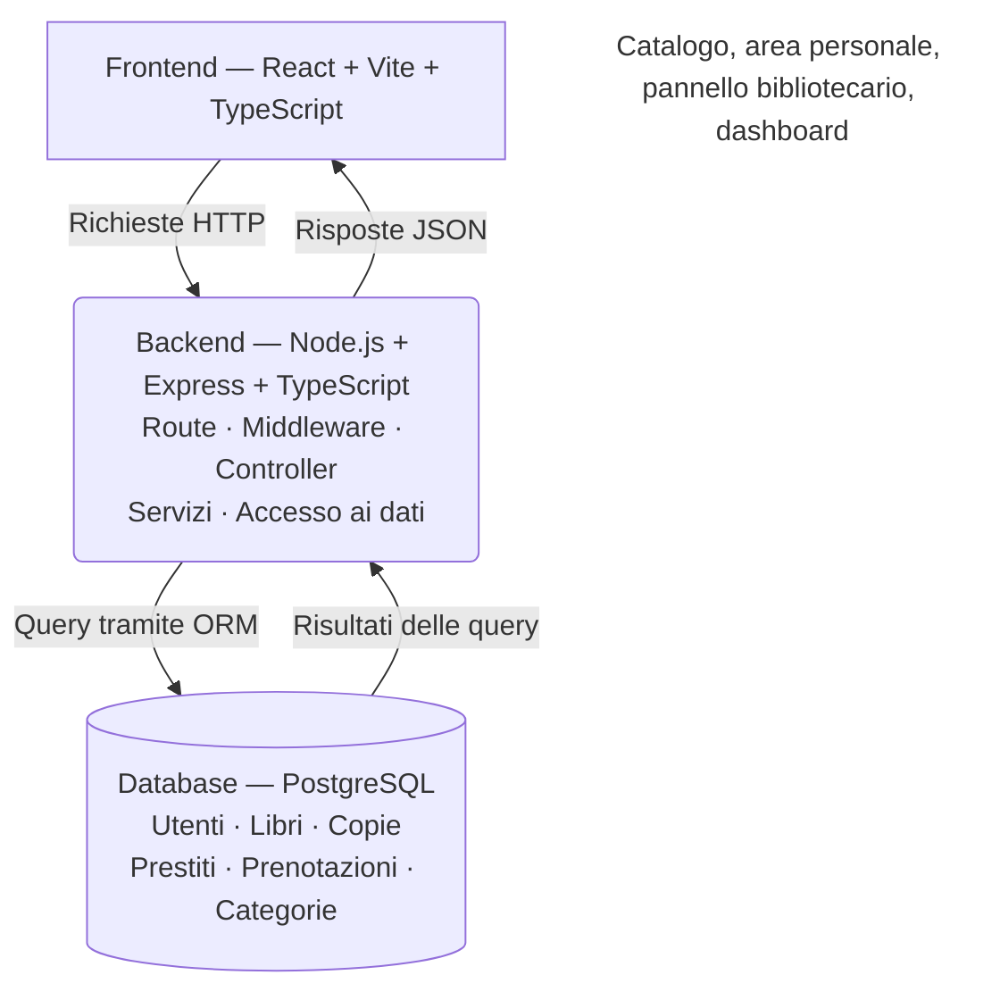

```mermaid
flowchart TB
    A["Frontend — React + Vite + TypeScript"] -- Richieste HTTP --> B("Backend — Node.js + Express + TypeScript<br>Route · Middleware · Controller<br>Servizi · Accesso ai dati")
    B -- Risposte JSON --> A
    B -- Query tramite ORM --> C[("Database — PostgreSQL<br>Utenti · Libri · Copie<br>Prestiti · Prenotazioni · Categorie")]
    C -- Risultati delle query --> B
    n1["Catalogo, area personale, pannello bibliotecario, dashboard"]

    n1@{ shape: text}
```