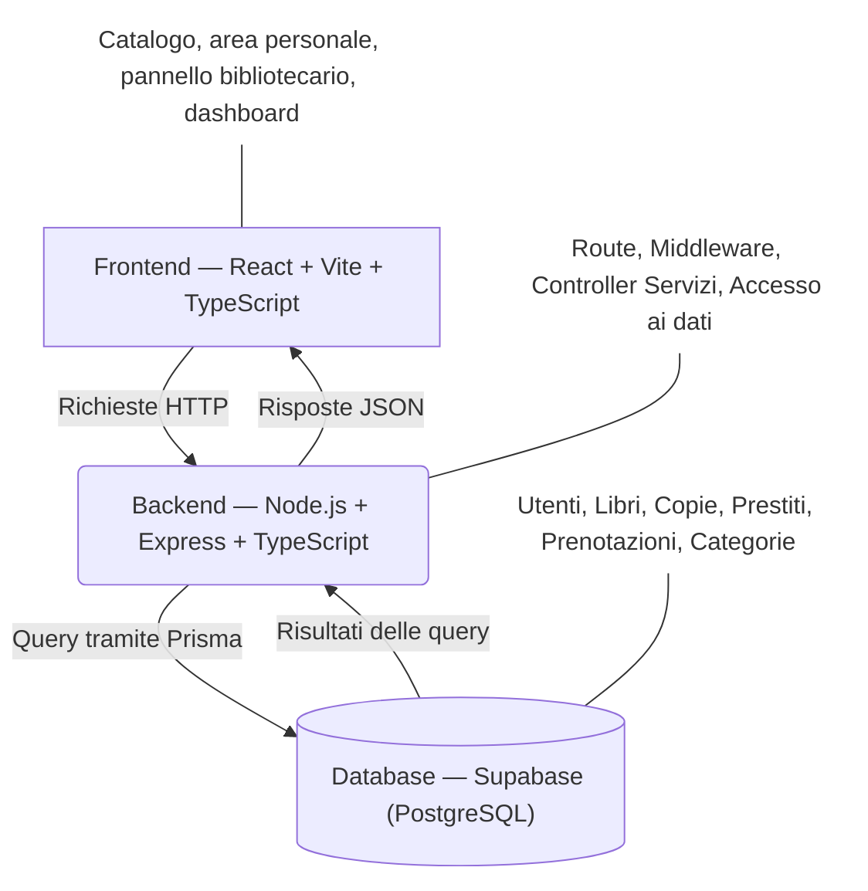

## Stack tecnologico

```mermaid
flowchart TB
    A["Frontend — React + Vite + TypeScript"] -- Richieste HTTP --> B("Backend — Node.js + Express + TypeScript<br>")
    B -- Risposte JSON --> A
    B -- Query tramite Prisma --> C[("Database — Supabase (PostgreSQL)")]
    C -- Risultati delle query --> B
    n1["Catalogo, area personale, pannello bibliotecario, dashboard"]
    n2["Route, Middleware, Controller Servizi, Accesso ai dati"]
    n3["Utenti, Libri, Copie, Prestiti, Prenotazioni, Categorie"]

    n1@{ shape: text}
    n2@{ shape: text}
    n3@{ shape: text}
    n1 --- A
    n2 --- B
    n3 --- C
```